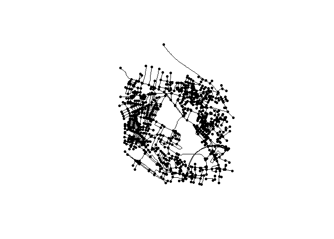

<!-- README.md is generated from README.qmd. Please edit that file -->

# osmextract.tools

<!-- badges: start -->

[](https://lifecycle.r-lib.org/articles/stages.html#experimental)
<!-- [](https://CRAN.R-project.org/package=osmextract.tools) -->
<!-- badges: end -->

The goal of osmextract.tools is to provide additional functionalities
for the data obtained with `osmextract`.

> [!WARNING]
>
> This package is under active development and may change without
> notice.

## Installation

You can install the development version of osmextract.tools from
[GitHub](https://github.com/) with:

``` r
# install.packages("pak")
pak::pak("juanfonsecaLS1/osmextract.tools")
```

## Example

A common use of OSM data is to prepare routable networks. The following
example shows how to use `osmextract.tools` to prepare a routable
network from OSM data.

The following code will download OSM data for a given area, extract the
road network, and return a `sfnetwork` object representing a directed
graph.

``` r
library(osmextract.tools)
library(sf)

## basic example code

my_area <- sf::st_point(c(-1.5584637048901326, 53.80817188808102)) |>
  sf::st_sfc(crs = 4326) |>
  sf::st_buffer(units::set_units(1, "km"))

sfnet <- oe_get_sfnetwork(my_area, "driving", directed = TRUE)
```

    #> ℹ Loading osmextract.tools
    #> The input place was matched with West Yorkshire. 
    #> 
    #> Setting 'boundary = place' to geographically subset the output. Use boundary = NA to import full extract.
    #> 
    #> The chosen file was already detected in the download directory. Skip downloading.
    #> 
    #> Starting with the vectortranslate operations on the input file!
    #> 0...10...20...30...40...50...60...70...80...90...100 - done.
    #> Finished the vectortranslate operations on the input file!
    #> Reading layer `lines' from data source 
    #>   `C:\temp\osmextract\geofabrik_west-yorkshire-latest.gpkg' using driver `GPKG'
    #> Simple feature collection with 1466 features and 15 fields
    #> Geometry type: LINESTRING
    #> Dimension:     XY
    #> Bounding box:  xmin: -1.576491 ymin: 53.79756 xmax: -1.540514 ymax: 53.82396
    #> Geodetic CRS:  WGS 84
    #> The implied oneway restriction is applied.
    #> Warning: to_spatial_subdivision assumes attributes are constant over geometries

A quick visualisation

``` r
plot(sfnet)
```


